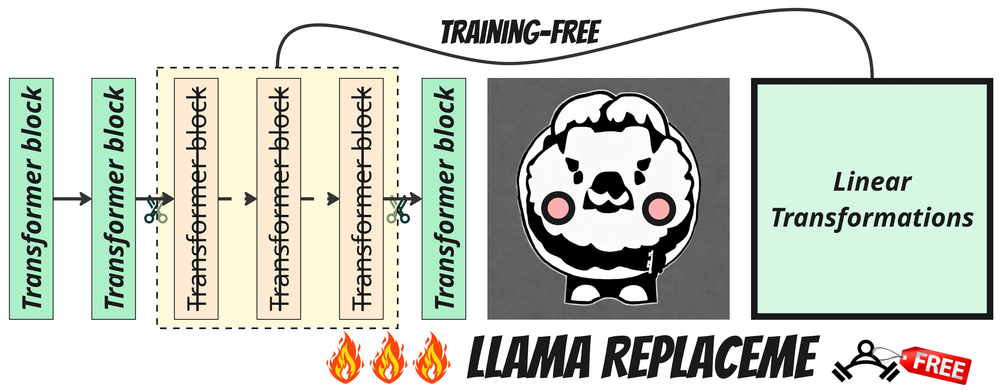

# ReplaceMe: Training-Free Depth Pruning via Block Pruning & Linear Transformations 🔥

[](https://arxiv.org/abs/2505.02819)
[](https://opensource.org/licenses/Apache-2.0)
[](https://www.python.org/downloads/)



**The first training-free depth pruning method for transformer-based LLMs** - Achieve model compression while preserving performance through innovative block pruning and learned linear transformations.

## 🚀 Quick Start
It is highly recommended to use this docker image
```
nvcr.io#nvidia/pytorch:23.10-py3
```
### Installation
```bash
git clone https://github.com/mts-ai/ReplaceMe.git
cd patchme
pip install -e .
```
### Basic Usage
```bash
# LSTSQ method (recommended)
run_replaceme --config ./reproduce/Replace_Me_pipeline_lstsq.yaml

# Cosine similarity method
run_replaceme --config ./reproduce/Replace_Me_pipeline_cosine.yaml
```
## 🔧 Advanced Configuration
Sample Configuration File
```yaml
# Core Parameters
method: "lstsq"  # [lstsq|cosine]
model_path: "meta-llama/Meta-Llama-3-8B-Instruct"
dataset: "Open-Orca/SlimOrca"
dataset_column: "text"

# Computational Settings
batch_size: 8
max_length: 1024
use_4bit: True  # 4-bit quantization for activations

# Pruning Configuration
layers_to_skip: 8
min_distance_layer: 20  # Minimum layer to consider for pruning
merge_consecutive: True  # Merge consecutive pruned layers

# Regularization & Optimization
alpha: 0  # Ridge regularization factor
num_A: 1  # Number of transformation matrices

# Output Control
save_path: null
save_transform_only: True  # Save LT matrices separately
```
# Key Features
Training-Free Pruning ✂️: Remove layers without fine-tuning

Multi-Method Support 🤖: Choose between LSTSQ or Cosine similarity approaches

Hardware-Aware 💻: 4-bit quantization support for efficient computation

Flexible Configuration 🎛️: Customize pruning depth, regularization, and output formats

# 📊 Performance Highlights
| **Method**          | **Transf.**        | **Train. req.** | **BoolQ** | **HS**  | **PIQA** | **MMLU** | **Avg**  | **%**   |
|---------------------|--------------------|-----------------|-----------|--------|----------|----------|----------|---------|
| Llama 2 7B          | -                  | ✔️              | 0.708     | 0.713  | 0.781    | 0.492    | 0.674    | 100     |
| LLM-Streamline*     | layer MSE          | ✔️              | 0.675     | 0.611  | 0.715    | **0.455**| 0.614    | 91.2    |
| LLMPruner*          | -                  | ✔️              | 0.587     | 0.546  | **0.720**| 0.253    | 0.527    | 78.2    |
| SliceGPT*           | -                  | ✔️              | 0.599     | 0.475  | 0.683    | 0.288    | 0.511    | 75.9    |
| LaCo*               | -                  | ✔️              | 0.641     | 0.557  | 0.698    | 0.265    | 0.540    | 80.2    |
| UIDL*               | -                  | ✔️              | 0.673     | 0.597  | 0.690    | 0.446    | 0.602    | 89.3    |
| **ReplaceMe (ours)**  | linear lstsq       | ❌              | 0.715     | 0.613  | 0.698    | 0.451    | 0.619    | 91.9    |
| **ReplaceMe (ours)**  | linear cosine      | ❌              | **0.728** | **0.622**| 0.705   | 0.453    | **0.627**| **93.1**|


Results on Llama 2 7B with 25% compression ratio. Higher % indicates better performance retention.

# 🛠️ Developer Tools
Modular Components
```bash
# Model Evaluation
evaluate_model --config your_config.yaml

# Distance Analysis
get_distance_analysis --model meta-llama/Llama-2-7b

# Transformation Matrix Generation
get_lt_with_lstsq --dataset slimorca --layers 8
get_lt_with_solvers --method cosine --alpha 0.1
```
# 📚 Citation
If you use ReplaceMe in your research, please cite our paper:

```bibtex
@article{shopkhoev2025replaceme0,
  title   = {ReplaceMe: Network Simplification via Layer Pruning and Linear Transformations},
  author  = {Dmitriy Shopkhoev and Ammar Ali and Magauiya Zhussip and Valentin Malykh and Stamatios Lefkimmiatis and Nikos Komodakis and Sergey Zagoruyko},
  year    = {2025},
  journal = {arXiv preprint arXiv: 2505.02819}
}
```
# 🤝 Contributing
We welcome contributions! Please see our contribution guidelines and open an issue before submitting major changes.

Maintained by MTS AI Research 
- Documentation
- Paper
